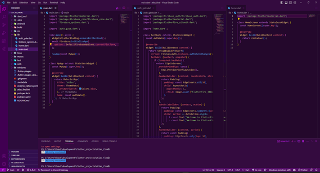
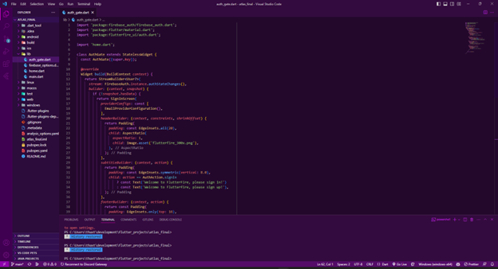
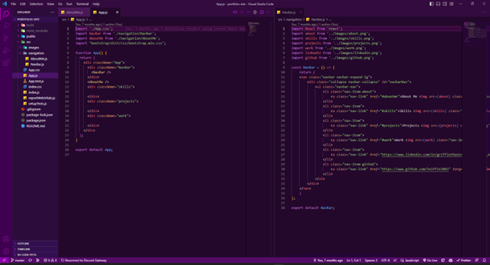

# Amethyst Dreams

## What is it
Amethyst Dreams is a VSCode color theme that I developed. It used purple and pink undertones to make everything really pop. I hope you like it!

## How to Download and Use?
This is published right on the VSCode marketplace so by simply searching up "Amethyst Dreams" in the marketplace it should be available for you to download and use!

Or by going to this link you can download it from the marketplace directly
https://marketplace.visualstudio.com/items?itemName=Sniffin.amethyst-dreams&ssr=false#overview 

## Screenshots!

### Credits
Design by Griffin Thaxter

Icon by Daniel Olah
https://unsplash.com/photos/ON0jlgkd8R0?utm_source=unsplash&utm_medium=referral&utm_content=creditShareLink
